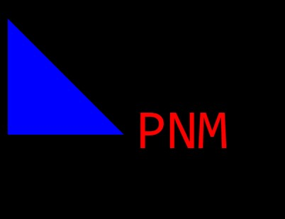

# Logo-Generator
Generates a basic logo based on pre-set options

## Description

This application generates a basic logo based on pre-set options from the integrated terminal.

### List of Features 

1. The option to choose 3 letters that will be included in the logo
2. The option to choose a logo shape
3. The option to choose colors for the logo.
4. A jest function testing package.

### Usage

This application will generate a logo.

### Preview

https://drive.google.com/file/d/10AAgg1yvDjlvSOuaF7uucyxGFE4JDI9U/view?usp=sharing

